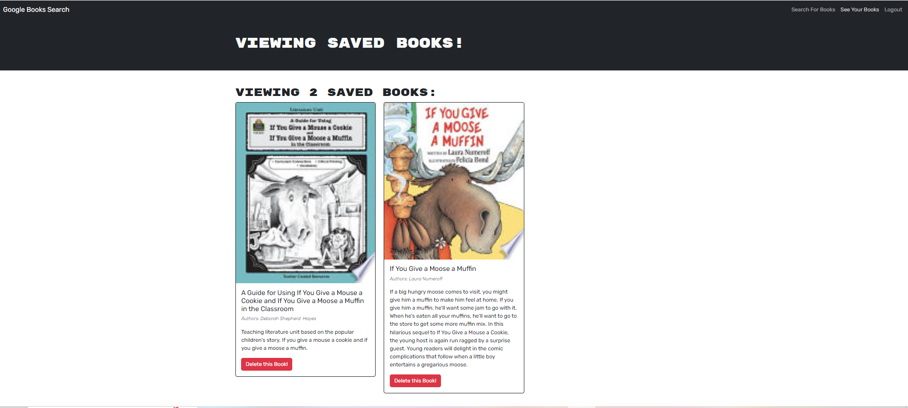
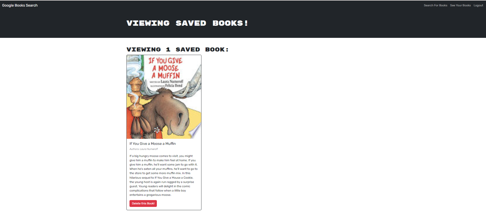

# MERN Book Search Engine

## Description

This is MERN application that allows the user to search for books and save them to a book list for future reference.

## Usage

To use this application, enter the name of a book in the search bar and click search. If you want to be able to save books, then click signup/login in navigation and enter your credentials. Now when you search for a book, there will be a button on each result to save the book, that, when clicked, will change to a deactivated button to display that it has been saved. The user can see their list of saved books by clicking on saved books in navigation, where each saved book will have a button to delete from the list and will disappear on deletion.

[Deployed Application](https://book-search-engine-6dm4.onrender.com)

## Credits

Tutor: Saving the query data into a variable so the page loads and not the error element (SavedBooks, line: 24)
